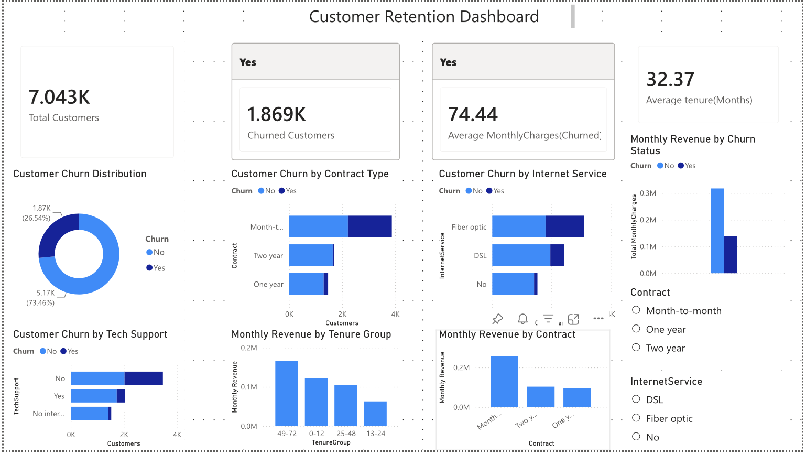

# Customer Retention Strategy Analysis
End-to-end customer churn analysis using SQL, Python, and Power BI
## Project Overview

This project analyzes customer churn for a telecommunications company using SQL, Python, and Power BI. The goal is to identify patterns associated with customer churn, understand the financial impact of customer attrition, and provide data-driven recommendations that could help improve customer retention.

The project follows an end-to-end analytics workflow, including data preparation and exploratory analysis in Python, business-focused analysis using SQL, and an interactive Power BI dashboard for communicating key findings.

## Business Problem

Customer churn can reduce recurring revenue and increase the cost of acquiring replacement customers. The company needs to better understand which customer groups are most likely to leave and what characteristics are associated with higher churn.

The objective of this analysis is to identify high-risk customer segments, evaluate the relationship between customer behavior and churn, measure the financial impact of customer attrition, and uncover opportunities to improve customer retention.

## Business Questions

This project explores the following questions:

- What percentage of customers are churning?
- Do churned customers have shorter average tenure?
- How does contract type relate to customer churn?
- Which internet service types have the highest levels of churn?
- Do churned customers pay higher monthly charges?
- How much monthly revenue is associated with churned customers?
- Does access to tech support relate to customer retention?
- Which customer tenure groups generate the most monthly revenue?
- Which contract types generate the most monthly revenue?

## Dataset

The analysis uses the Telco Customer Churn dataset, which contains information on 7,043 customers.

The dataset includes:

- Customer demographics
- Contract information
- Internet and phone services
- Tech support and online services
- Customer tenure
- Monthly and total charges
- Customer churn status

## Power BI Dashboard

An interactive Power BI dashboard was developed to communicate the key findings from the analysis.

## Key Insights

- Approximately 26.5% of customers in the dataset churned.
- Month-to-month customers represented the largest group of churned customers.
- Churned customers had shorter average tenure than retained customers.
- Fiber optic customers represented a significant portion of customer churn.
- Customers without tech support experienced higher levels of churn.
- Churned customers had higher average monthly charges than retained customers.
- Long-tenure customers contributed significant monthly revenue.

## Business Recommendations

Based on the analysis:

- Develop targeted retention strategies for month-to-month customers.
- Encourage customers to transition to longer-term contracts through incentives or loyalty benefits.
- Investigate the customer experience and perceived value of fiber optic services.
- Promote tech support services to customer segments with elevated churn risk.
- Target newer customers with early-stage engagement and retention initiatives.
- Prioritize high-value customer segments when designing retention campaigns.
